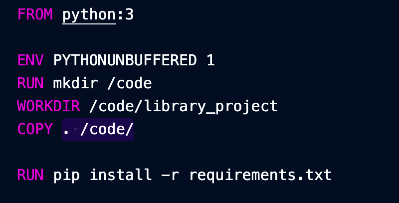
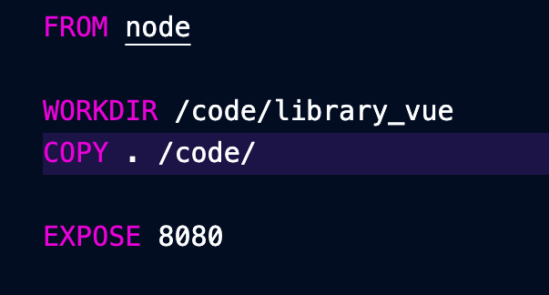

# Содержание Docker файлов

## Сожержание Dockerfile в backend

## Содержание Dockerfile в frontend

## Содержание Docker-compose файла

    version: '3'

    services:
    db:
        image: postgres:13.0-alpine
        volumes:
            - ./data/db:/var/lib/postgresql/data/
        environment:
            - POSTGRES_DB=library_db
            - POSTGRES_USER=postgres
            - POSTGRES_PASSWORD=postgres
        ports:
            - "5432:5432"

    rest:
        build:
        context: .
            dockerfile: library_project/Dockerfile
        container_name: library-backend
        command: bash -c 'sleep 10 && python manage.py runserver 0.0.0.0:8000'
        volumes:
            - .:/code
        ports:
            - "8000:8000"
        depends_on:
            - db

    vue:
        build:
        context: .
        dockerfile: library_vue/Dockerfile
        container_name: library-frontend
        command: npm run serve
        volumes:
            - .:/code
        ports:
            - "8080:8080"
        depends_on:
            - rest
