#### Задание 4.1.1

Необходимо реализовать интерфейс списков объектов, в котором подключить фильтры из второй лабораторной. В интерфейсе должен быть обеспечен следующий функционал:

- сортировка объектов.
- пагинация.
- поиск по объектам.
- фильтрация с чекбоксами.
- фитры на диапазон.

Можно сказать, необходимо реализовать страничку с фильтрами, как в интернет магазине и подключить к бэкенду.

### Регистрация:
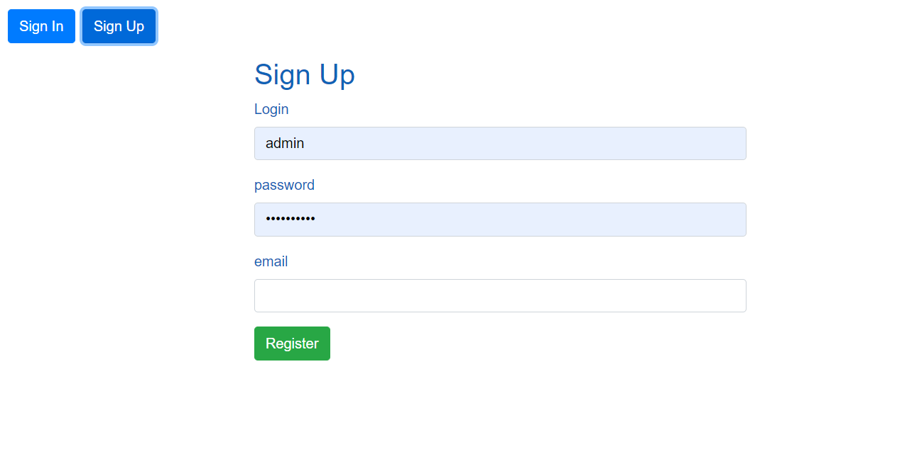

### Вход:
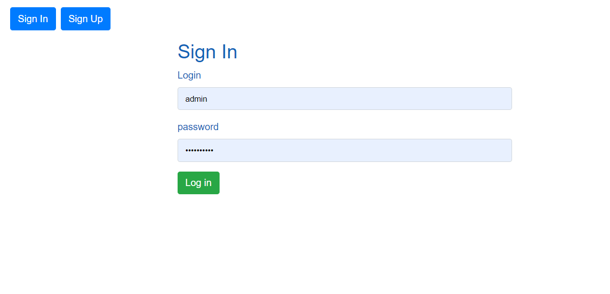

### Главная страница: 

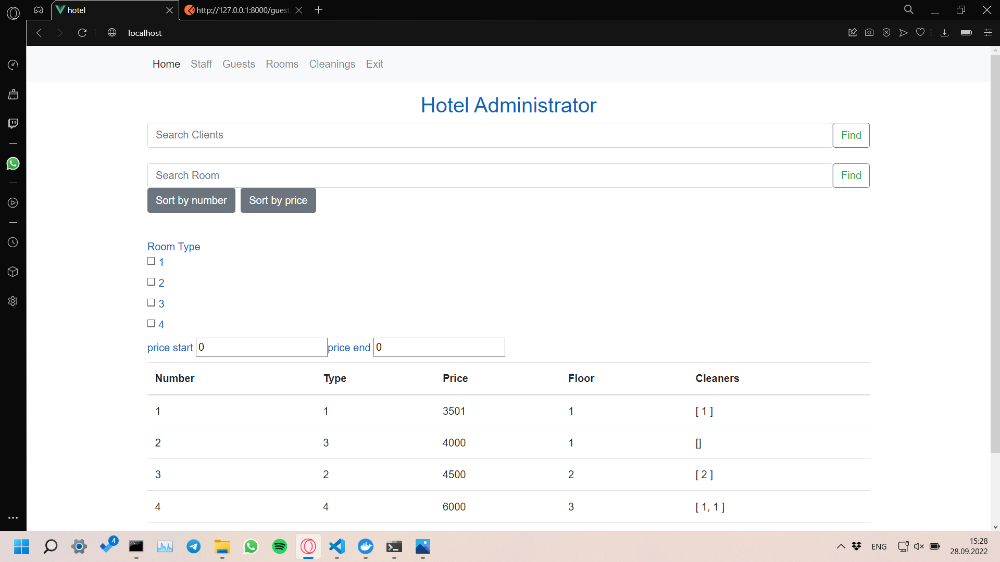

## Регистрация:

## Поиск гостя:
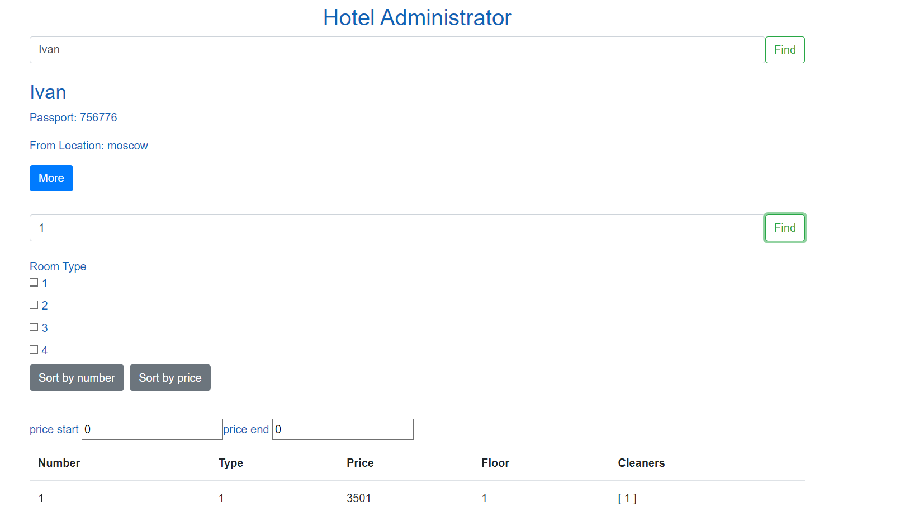

## Поиск комнаты:
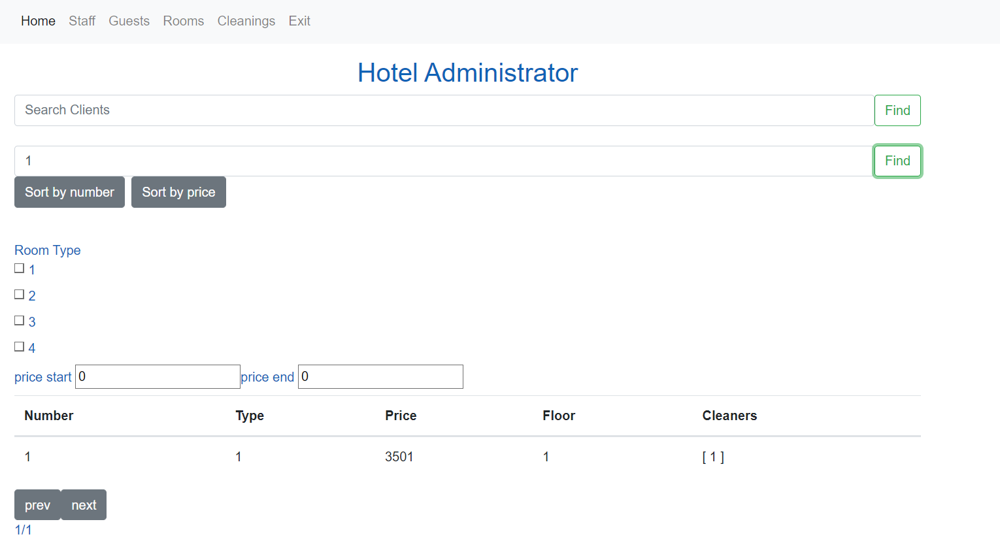

## Фильтрация по номеру:
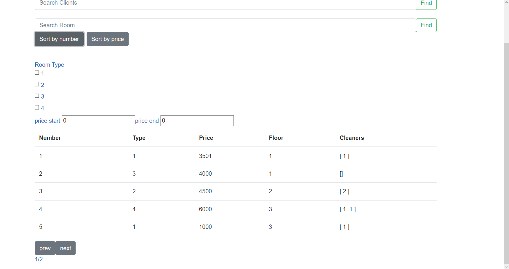

## Фильтрация по цене:
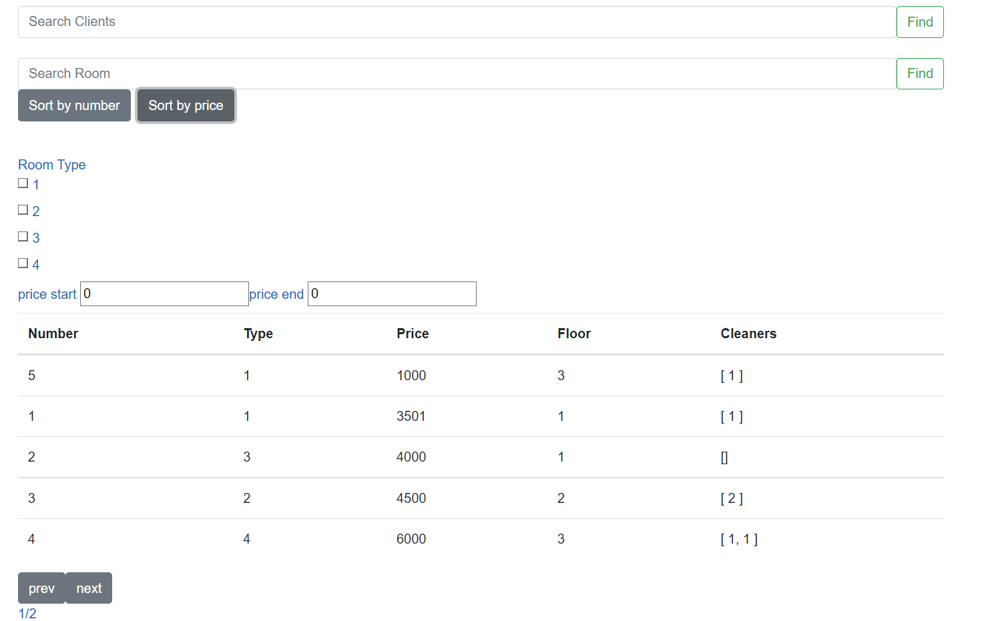

## Фильтрация по типу:
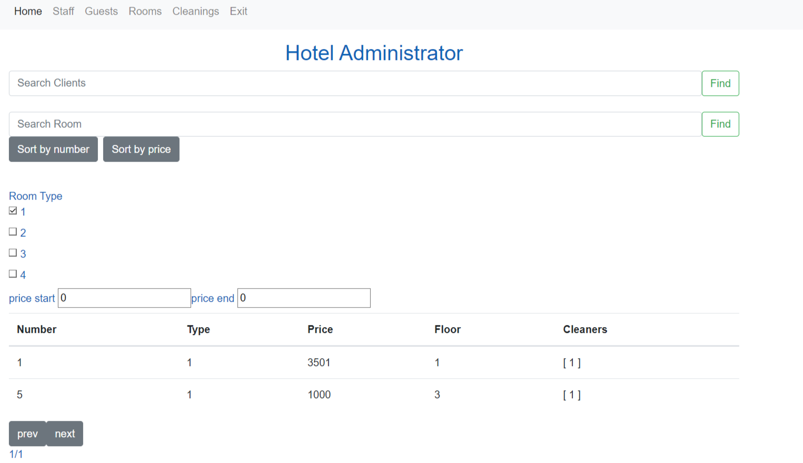

## Диапазон цен:
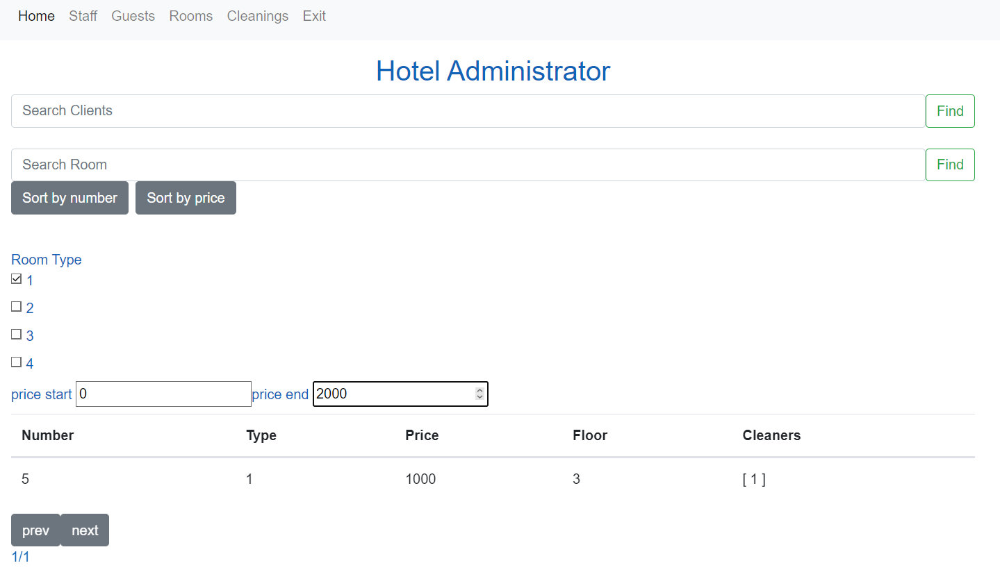

### Создание и просмотр админов:
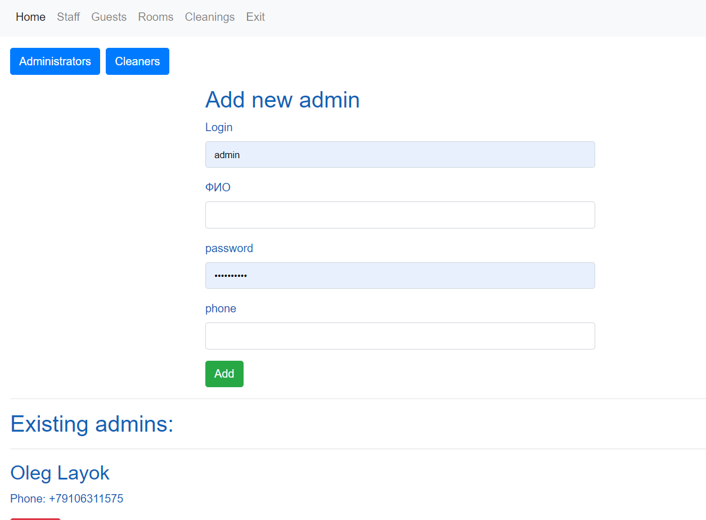

### Создание и просмотр уборщиков:
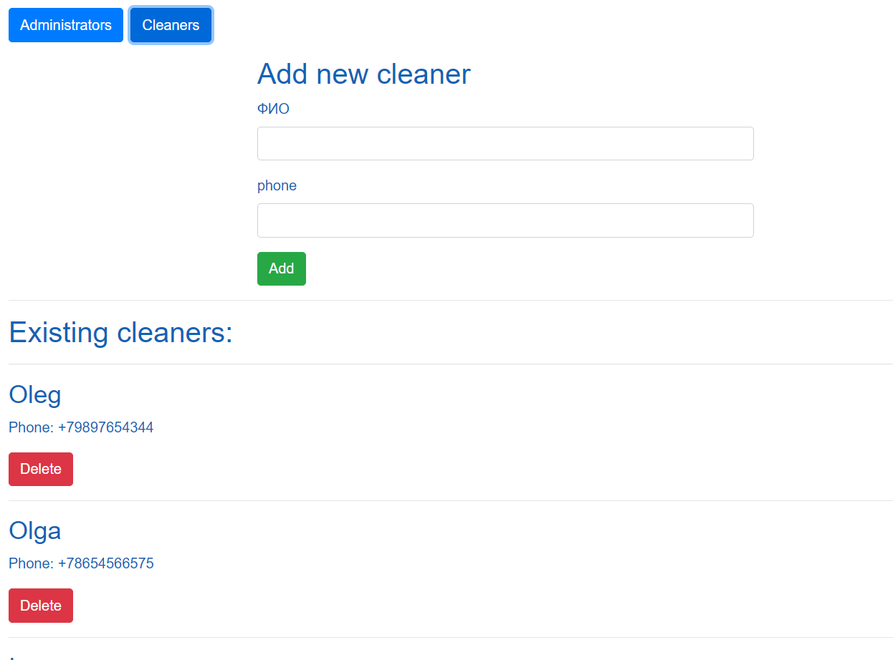

### Просмотр гостей:
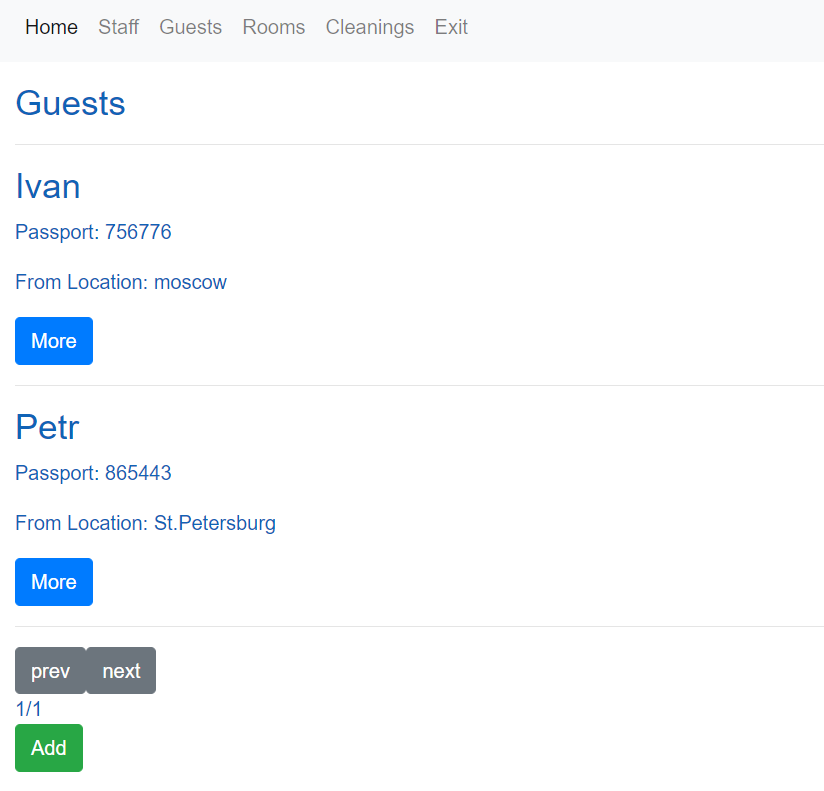

### Просмотр комнат:
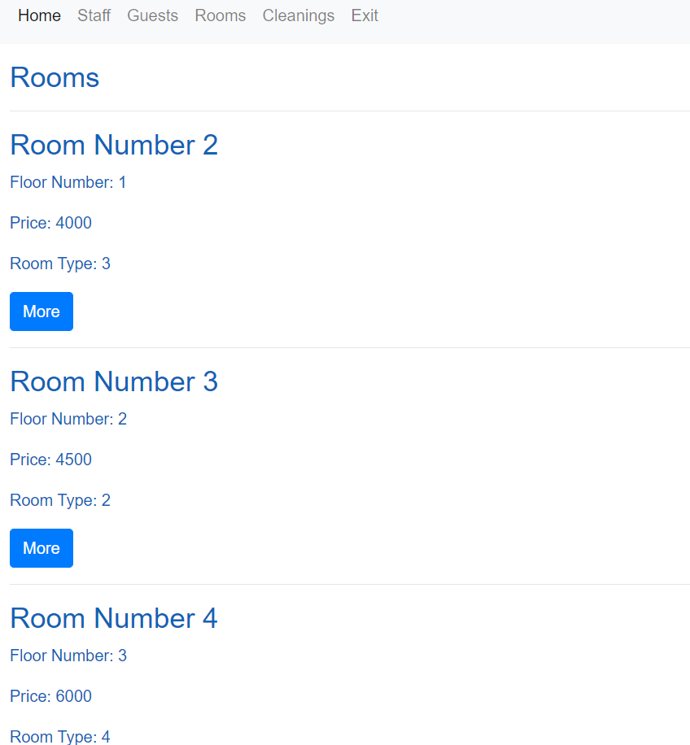

### Расписание уборок:
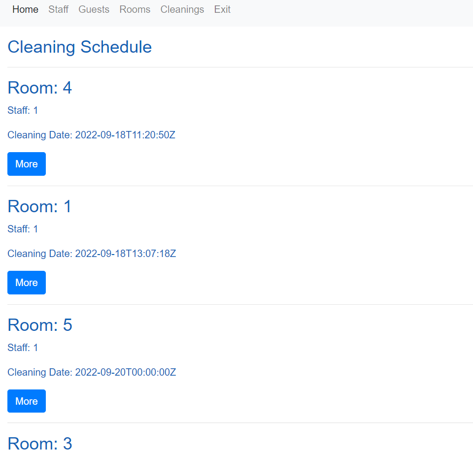