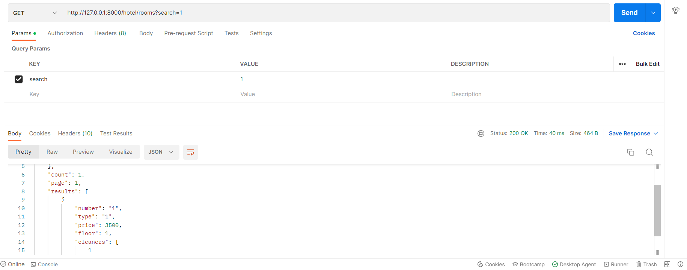

#### Задание 2.1.2

Реализвать в ручную следующие фильтры (Необходимо использовать библиотеку django-filters:

- сортировка по дате, поиск, поиск по полям из связной таблицы
- сортировка в диапазоне цен, дат или каких-либо других числовых значений

### Регистрируем django-filters и добавляем методы фильтрации по умолчанию:

```python
'DEFAULT_FILTER_BACKENDS':
        ['django_filters.rest_framework.DjangoFilterBackend']
```

### Сортировка по дате уборки, фильтрация по имени уборщика и номеру комнаты (связная таблица); поиск по дню уборки, комнате и имени уборщика:

```python
class CleaningAPIView(viewsets.ModelViewSet):
    permission_classes = [IsAuthenticated]
    serializer_class = CleaningSerializer
    queryset = Cleaning.objects.all()

    filter_backends = (DjangoFilterBackend, OrderingFilter, SearchFilter)
    filterset_fields = ['room__number','staff__name']
    search_fields = ['date_time', "room__number", 'staff__name']
    ordering_fields = ['date_time']
    ordering = ['date_time']
```


### Фильтрация в диапазоне цены и номеров комнаты; поиск по номеру;сортировка по цене и номеру

```python
class RoomFilter(FilterSet):
    price = RangeFilter()
    number = RangeFilter()
    type = MultipleChoiceFilter(
        choices=Room.ROOM_TYPE
    )
    class Meta:
        model = Room
        fields = ['price', 'number','type']


class RoomAPIView(viewsets.ModelViewSet):
    permission_classes = [IsAuthenticated]
    serializer_class = RoomSerializer
    queryset = Room.objects.all()

    filter_backends = [DjangoFilterBackend, OrderingFilter, SearchFilter]
    filterset_class = RoomFilter
    filterset_fields = ['price','number','type']
    search_fields = ['number']
    ordering_fields = ['number', 'price']
    pagination_class = CustomPagination
```



### Фильтрация в диапазоне дат заселения, даты выезда; поиск по имени и паспорту:

```python
class GuestFilter(FilterSet):
    check_in_date = DateFromToRangeFilter()
    check_out_date = DateFromToRangeFilter()

    class Meta:
        model = Guest
        fields = ['check_in_date','check_out_date']


class GuestAPIView(viewsets.ModelViewSet):
    permission_classes = [IsAuthenticated]
    serializer_class = GuestSerializer
    queryset = Guest.objects.all().order_by('id')

    filter_backends = [DjangoFilterBackend, OrderingFilter, SearchFilter]
    filterset_class = GuestFilter
    filterset_fields = ['check_in_date','check_out_date']
    search_fields = ['name','passport_number']
    ordering_fields = ['check_in_date','check_out_date']
    pagination_class = CustomPagination
```
