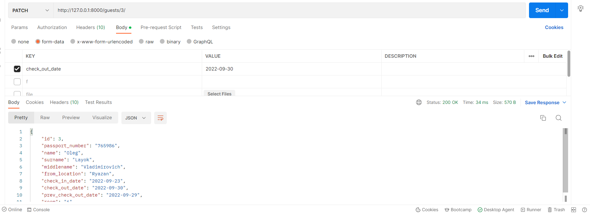
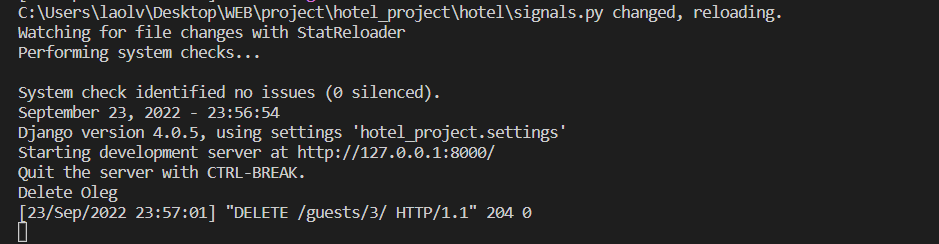

#### Задание 2.4.1

Реализовать 3 сигнала, которые:

- Вызывает логику, во время создания экземаляра объекта.
- Сохраняет значения выбранных полей в таблице в специальные поля для хранения предыдущих значений при обновлении объекта.
- При удалении объекта записывает информацию об удалении в лог реализованный любым образом.

### Для регистрации сигналов добавим конфигурацию ready в apps.py:

```python
class HotelAppConfig(AppConfig):
    default_auto_field = 'django.db.models.BigAutoField'
    name = 'hotel'

    def ready(self):
        import hotel.signals
        super().ready()
```

### Сигнал 1: создание гостя:

```python
@receiver(post_save, sender=Guest)
def save_logic(sender, instance, created, **kwargs):
    if created:
        print("New Guest created")
```


### Сигнал 2: обновление данных о дате выезда с сохранением старой даты:

```python
@receiver(pre_save, sender=Guest)
def update(sender, instance, **kwargs):
    try:
        prev_instance = Guest.objects.get(id=instance.id)
        instance.prev_check_out_date = prev_instance.check_out_date
        print("Prev check-out date updated")
    except:
        pass
```
### До изменения:


### После изменения:




### Сигнал 3: удаление гостя и логирование:

```python
@receiver(post_delete, sender=Guest)
def delete_log(sender, instance, **kwargs):
    print(f"Delete {instance.name}")
```


