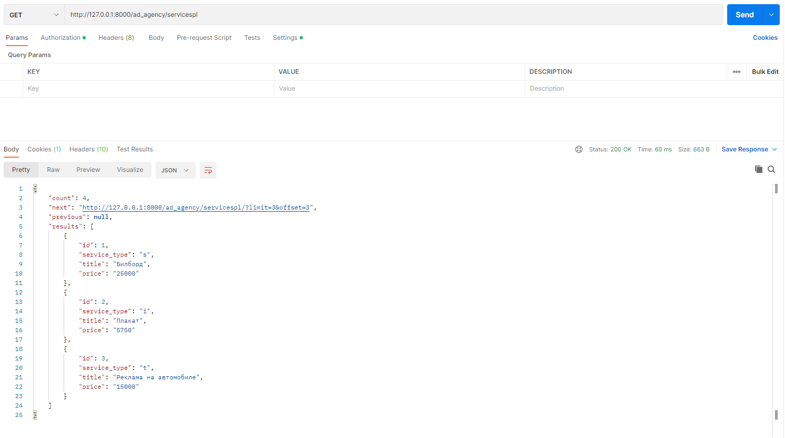

#### Задание 2.2.1

Настроить пагинацию для любых списков в Вашем проекте.

### Добавим стандартную конфигурацию:

```python
    'DEFAULT_FILTER_BACKENDS':
        ['django_filters.rest_framework.DjangoFilterBackend'],
    'DEFAULT_PAGINATION_CLASS': 'rest_framework.pagination.LimitOffsetPagination',
    'PAGE_SIZE': 3
```

